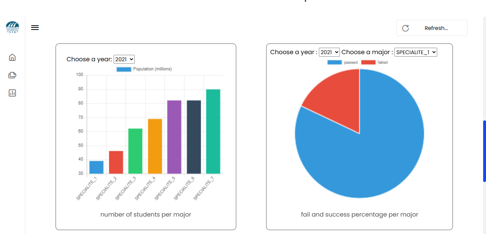
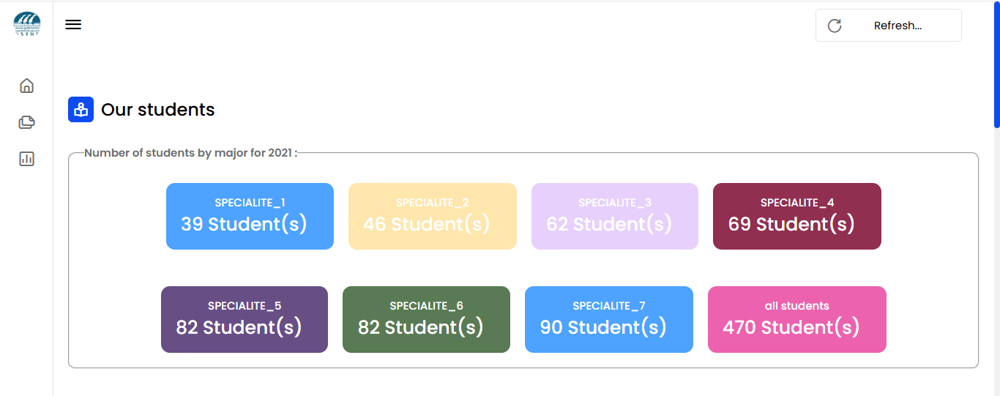
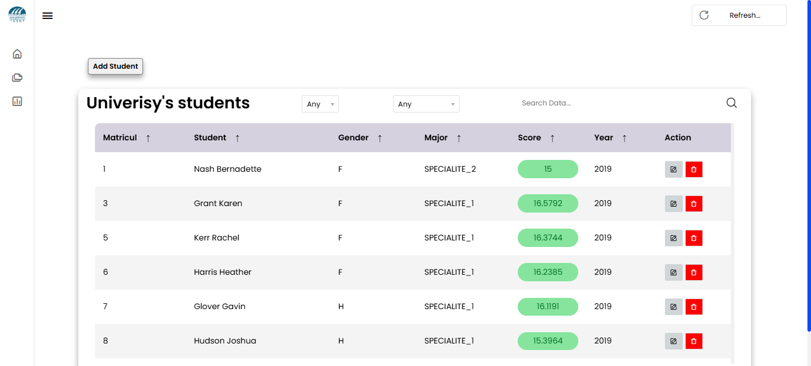
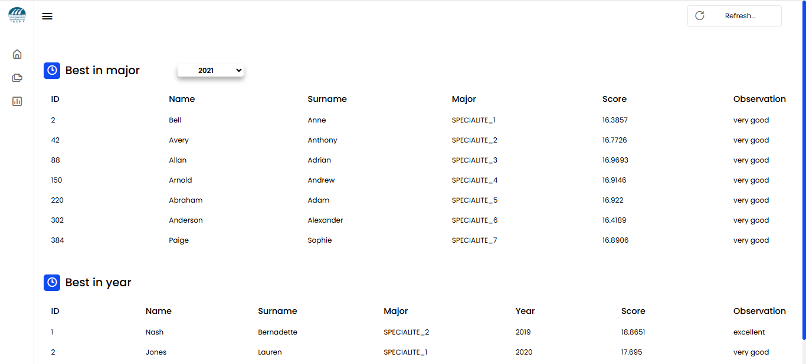

#  University Management Dashboard
A web-based dashboard for managing university data, built using Flask, MySQL, HTML,
CSS, and JavaScript. This project allows administrators to manage students, view
academic statistics, and visualize key performance indicators through interactive charts
and tables.

## Features
• Add, update, and delete student records  
• Display student data by year and specialization  
• Show top-performing students per year  
• Visualize: number of students per year and specialization, pass/fail rates, and gender
distribution  
• RESTful API endpoints for data retrieval and analytics  

## Technologies Used
Backend: Flask (Python)  
Frontend: HTML, CSS, JavaScript  
Database: MySQL  
API: RESTful (Flask routes returning JSON)  

## Installation & Setup
1 Clone the repository: `git clone
https://github.com/Mohamedtb0221/flask-dashboard-app.git`   
2 Create and activate a virtual environment  
3 Install dependencies: `pip install flask flask-mysql flask-mysqldb`  
4 Configure MySQL with database `db_university`  
5 Run the application: `python app.py`  
6 Access the app at: http://127.0.0.1:5000/  

## Preview
  
### Dashboard Home

### Some Dashboard Charts

### Students Table  

### Analytics Page

## Author
Mohamed Taboukouyout — Master 2 Big Data – Algeria
### mohamedtaboukouyout09@gmail.com
